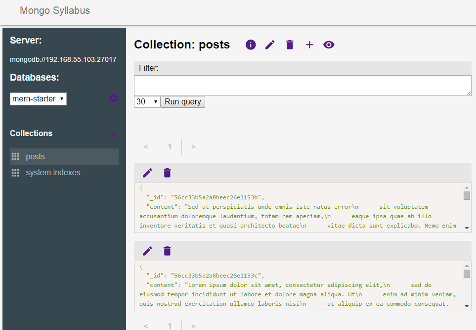
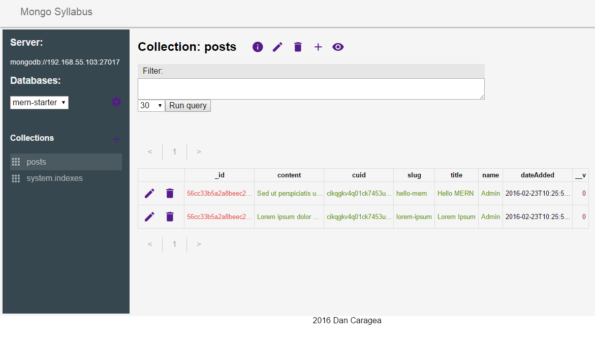

# mongo-syllabus

[![Build Status][travis-image]][travis-url]

React based Mongodb admin interface. Currently work in progress but `master` is already in an usable state.

This is as much a playground for me to experiment with various current frontend development tools as it is a tool I badly
 needed when working with mongodb.

## Interested in helping out?

PRs, feature requests, bug reports or discussing ideas - they're all welcome. Get in touch! 

A screenshot from development:

Another one:

[travis-url]: https://travis-ci.org/terebentina/mongo-syllabus
[travis-image]: https://img.shields.io/travis/terebentina/mongo-syllabus.svg

## License

[The MIT License](./LICENSE)

Copyright (c) 2016 Dan Caragea
